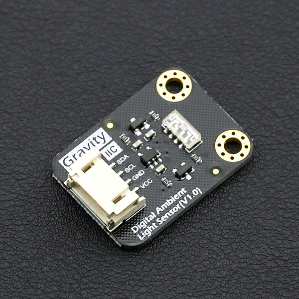

# DFRobot_VEML7700
* [中文版](./README_CN.md)

VEML7700 is a high accuracy ambient light digital 16-bit resolution sensor in a mininature transparent 6.8mm×2.35mm×3.0mm package.
It includes a high sensitive photo diode, a low noise amplifier, a 16-bit A/D converter and supports an easy-to-use Gravity I2C bus communication interface.
The ambient light result is available as digital value.




## Product Link (https://www.dfrobot.com/product-1620.html)
    SKU：SEN0228


## Table of Contents

* [Summary](#summary)
* [Installation](#installation)
* [Method](#method)
* [Compatibility](#compatibility)
* [History](#history)
* [Credits](#credits)


## Summary

* Filtrate tm technology adoption: close to real human eye reaction
* O-TrimTM technology adoption: ALS output tolerance
≤10%
* 16-bit dynamic range for ambient light detection from
0 lx to 120 KLX with resolution 0.0036 lx/ct, support low transmittance (dark) lens design
* 100hz and 120hz flicker noise rejection 
* Excellent temperature compensation
* High dynamic detection resolution 
* Software shutdown mode control


## Installation

Download the library file before use, paste it into the \Arduino\Libraries directory, then open the sample folder and run the demo in the folder.


## Methods

```C++

  /**
   * @fn setGain
   * @brief Set ALS gain coefficient
   * @param gain Gain selection:
   * @n     ALS_GAIN_x1, ALS_GAIN_x2, ALS_GAIN_d8, ALS_GAIN_d4
   * @return Return operation result
   * @retval STATUS_OK Operation succeed, no anomaly
   * @retval STATUS_ERROR Operation failed
   */
  uint8_t setGain(eAlsGain_t gain);

  /**
   * @fn getGain
   * @brief Get the current ALS gain coefficient
   * @param gain The current ALS gain coefficient:
   * @n     ALS_GAIN_x1, ALS_GAIN_x2, ALS_GAIN_d8, ALS_GAIN_d4
   * @return Return operation result
   * @retval STATUS_OK Operation succeed, no anomaly
   * @retval STATUS_ERROR Operation failed
   */
  uint8_t getGain(eAlsGain_t& gain);

  /**
   * @fn setIntegrationTime
   * @brief Set ALS integration time
   * @param itime ALS integration time:
   * @n       ALS_INTEGRATION_25ms, ALS_INTEGRATION_50ms, ALS_INTEGRATION_100ms, 
   * @n       ALS_INTEGRATION_200ms, ALS_INTEGRATION_400ms, ALS_INTEGRATION_800ms
   * @return Return operation result
   * @retval STATUS_OK Operation succeed, no anomaly
   * @retval STATUS_ERROR Operation failed
   */
  uint8_t setIntegrationTime(eAlsItime_t itime);

  /**
   * @fn getIntegrationTime
   * @brief Get ALS integration time
   * @param itime The current ALS integration time:
   * @n       ALS_INTEGRATION_25ms, ALS_INTEGRATION_50ms, ALS_INTEGRATION_100ms, 
   * @n       ALS_INTEGRATION_200ms, ALS_INTEGRATION_400ms, ALS_INTEGRATION_800ms
   * @return Return operation result
   * @retval STATUS_OK Operation succeed, no anomaly
   * @retval STATUS_ERROR Operation failed
   */
  uint8_t getIntegrationTime(eAlsItime_t& itime);

  /**
   * @fn setPersistence
   * @brief persistence protect number setting
   * @param persist persistence protect number:
   * @n       ALS_PERSISTENCE_1, ALS_PERSISTENCE_2, ALS_PERSISTENCE_4, ALS_PERSISTENCE_8
   * @return Return operation result
   * @retval STATUS_OK Operation succeed, no anomaly
   * @retval STATUS_ERROR Operation failed
   */
  uint8_t setPersistence(eAlsPersist_t persist);

  /**
   * @fn setPowerSavingMode
   * @brief Power saving mode setting
   * @param powerMode Power saving mode:
   * @n       ALS_POWER_MODE_1, ALS_POWER_MODE_2, ALS_POWER_MODE_3, ALS_POWER_MODE_4
   * @return Return operation result
   * @retval STATUS_OK Operation succeed, no anomaly
   * @retval STATUS_ERROR Operation failed
   */
  uint8_t setPowerSavingMode(eAlsPowerMode_t powerMode);

  /**
   * @fn setPowerSaving
   * @brief Power saving mode enable setting
   * @param enabled :
   * @n       0 Disable
   * @n       1 Enable
   * @return Return operation result
   * @retval STATUS_OK Operation succeed, no anomaly
   * @retval STATUS_ERROR Operation failed
   */
  uint8_t setPowerSaving(uint8_t enabled);

  /**
   * @fn setInterrupts
   * @brief ALS interrupt enable setting
   * @param enabled :
   * @n       0 Disable
   * @n       1 Enable
   * @return Return operation result
   * @retval STATUS_OK Operation succeed, no anomaly
   * @retval STATUS_ERROR Operation failed
   */
  uint8_t setInterrupts(uint8_t enabled);

  /**
   * @fn setPower
   * @brief ALS shut down setting
   * @param on :
   * @n       0 power on
   * @n       1 shut down
   * @return Return operation result
   * @retval STATUS_OK Operation succeed, no anomaly
   * @retval STATUS_ERROR Operation failed
   */
  uint8_t setPower(uint8_t on);

  /**
   * @fn setALSHighThreshold
   * @brief Set interrupt high threshold 
   * @param thresh 16-bit high threshold value
   * @return Return operation result
   * @retval STATUS_OK Operation succeed, no anomaly
   * @retval STATUS_ERROR Operation failed
   */
  uint8_t setALSHighThreshold(uint32_t thresh);

  /**
   * @fn setALSLowThreshold
   * @brief Set interrupt low threshold
   * @param thresh 16-bit low threshold value
   * @return Return operation result
   * @retval STATUS_OK Operation succeed, no anomaly
   * @retval STATUS_ERROR Operation failed
   */
  uint8_t setALSLowThreshold(uint32_t thresh);

  /**
   * @fn getALS
   * @brief get high-resolution ALS output
   * @param als Buffer the sensor data, 16-bit data
   * @return Return operation result
   * @retval STATUS_OK Operation succeed, no anomaly
   * @retval STATUS_ERROR Operation failed
   */
  uint8_t getALS(uint32_t& als);

  /**
   * @fn getWhite
   * @brief get WHITE output
   * @param white Buffer the sensor data, 16-bit data
   * @return Return operation result
   * @retval STATUS_OK Operation succeed, no anomaly
   * @retval STATUS_ERROR Operation failed
   */
  uint8_t getWhite(uint32_t& white);

  /**
   * @fn getHighThresholdEvent
   * @brief Get high threshold trigger interrupt event
   * @param event :
   * @n       0 Not detect high threshold interrupt event
   * @n       1 Detected high threshold interrupt event
   * @return Return operation result
   * @retval STATUS_OK Operation succeed, no anomaly
   * @retval STATUS_ERROR Operation failed
   */
  uint8_t getHighThresholdEvent(uint8_t& event);

  /**
   * @fn getLowThresholdEvent
   * @brief Get low threshold trigger interrupt event
   * @param event :
   * @n       0 Not detect low threshold interrupt event
   * @n       1 Detected low threshold interrupt event
   * @return Return operation result
   * @retval STATUS_OK Operation succeed, no anomaly
   * @retval STATUS_ERROR Operation failed
   */
  uint8_t getLowThresholdEvent(uint8_t& event);

  /**
   * @fn begin
   * @brief Init function
   * @return None
   */
  void begin();

  /**
   * @fn begin
   * @brief Init function
   * @param als_gain Set ALS gain coefficient
   * @return None
   */
  void begin(uint8_t als_gain);

  /**
   * @fn getALSLux
   * @brief Get ALS illumination intensity value
   * @param lux Buffer the sensor data, 16-bit data
   * @return Return operation result
   * @retval STATUS_OK Operation succeed, no anomaly
   * @retval STATUS_ERROR Operation failed
   */
  uint8_t getALSLux(float& lux);

  /**
   * @fn getWhiteLux
   * @brief Get White illumination intensity value
   * @param lux Buffer the sensor data, 16-bit data
   * @return Return operation result
   * @retval STATUS_OK Operation succeed, no anomaly
   * @retval STATUS_ERROR Operation failed
   */
  uint8_t getWhiteLux(float& lux);

  /**
   * @fn getAutoALSLux
   * @brief Get AutoALS illumination intensity value
   * @param lux Buffer the sensor data, 16-bit data
   * @return Return operation result
   * @retval STATUS_OK Operation succeed, no anomaly
   * @retval STATUS_ERROR Operation failed
   */
  uint8_t getAutoALSLux(float& lux);

  /**
   * @fn getAutoWhiteLux
   * @brief Get AutoWhite illumination intensity value
   * @param lux Buffer the sensor data, 16-bit data
   * @return Return operation result
   * @retval STATUS_OK Operation succeed, no anomaly
   * @retval STATUS_ERROR Operation failed
   */
  uint8_t getAutoWhiteLux(float& lux);

  /**
   * @fn getAutoALSLux
   * @brief Get AutoALS illumination intensity value
   * @param lux Buffer the sensor data, 16-bit data
   * @param auto_gain Gain selection
   * @param auto_itime ALS integration time setting
   * @param raw_counts Raw counts
   * @return Return operation result
   * @retval STATUS_OK Operation succeed, no anomaly
   * @retval STATUS_ERROR Operation failed
   */
  uint8_t getAutoALSLux(float& lux,
                        DFRobot_VEML7700::eAlsGain_t& auto_gain,
                        DFRobot_VEML7700::eAlsItime_t& auto_itime,
                        uint32_t& raw_counts);

  /**
   * @fn getAutoWhiteLux
   * @brief Get AutoWhite illumination intensity value
   * @param lux Buffer the sensor data, 16-bit data
   * @param auto_gain Gain selection
   * @param auto_itime ALS integration time setting
   * @param raw_counts Raw counts
   * @return Return operation result
   * @retval STATUS_OK Operation succeed, no anomaly
   * @retval STATUS_ERROR Operation failed
   */
  uint8_t getAutoWhiteLux(float& lux,
                          DFRobot_VEML7700::eAlsGain_t& auto_gain,
                          DFRobot_VEML7700::eAlsItime_t& auto_itime,
                          uint32_t& raw_counts);

  /**
   * @fn sampleDelay
   * @brief Data sampling and process delay
   */
  void sampleDelay(void);

```


## Compatibility

MCU                | Work Well    | Work Wrong   | Untested    | Remarks
------------------ | :----------: | :----------: | :---------: | :----:
Arduino Uno        |      √       |              |             |
Arduino MEGA2560   |      √       |              |             |
Arduino Leonardo   |      √       |              |             |
FireBeetle-ESP8266 |      √       |              |             |
FireBeetle-ESP32   |      √       |              |             |
FireBeetle-M0      |      √       |              |             |
Micro:bit          |      √       |              |             |


## History

- 2021/10/15 - Version 1.0.0 released.


## Credits

Written by qsjhyy(yihuan.huang@dfrobot.com), 2021. (Welcome to our [website](https://www.dfrobot.com/))

