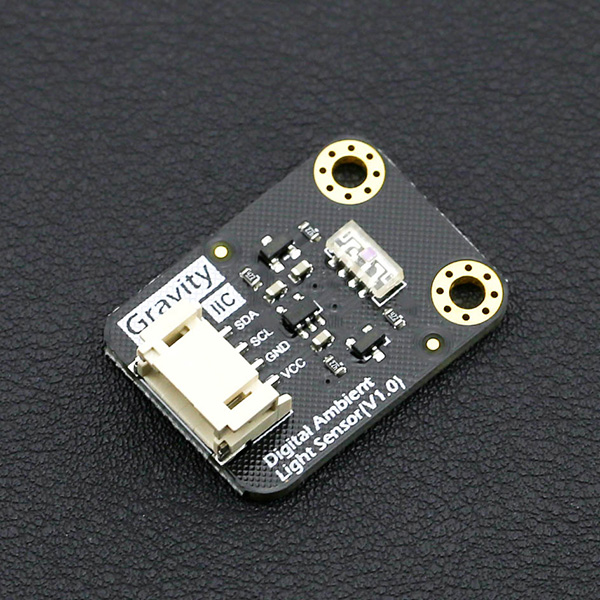

# DFRobot_VEML7700
* [English Version](./README.md)

VEML7700是一个高精度环境光数字16位分辨率传感器在微型透明6.8 mm x
2.35毫米x 3.0毫米包装。它包括一个高灵敏度的光电二极管，一个低噪声放大器，一个16位a /D转换器，并支持一个易于使用的I2C总线通信接口。
环境光结果作为数字值可用。




## 产品链接 (https://www.dfrobot.com.cn/goods-1430.html)
    SKU：SEN0228


## 目录

* [概述](#概述)
* [库安装](#库安装)
* [方法](#方法)
* [兼容性](#兼容性)
* [历史](#历史)
* [创作者](#创作者)


## 概述

* 滤液tm技术适配:接近真实人眼反应
* O-TrimTM技术采用:ALS输出公差
≤10%
* 16位动态范围的环境光检测
0 lx至120 KLX，分辨率为0.0036 lx/ct，支持低透光率(暗)镜头设计
* 100hz和120hz闪烁噪声抑制
* 良好的温度补偿
* 高动态检测分辨率
软件关机模式控制


## 库安装

要使用库, 首先下载库文件, 将其粘贴到指定的目录中, 然后打开Examples文件夹并在该文件夹中运行演示。


## 方法

```python

    '''!
      @brief 初始化函数
      @return  返回初始化状态
      @retval True 表示初始化成功
      @retval False 表示初始化成失败
    '''
    def begin(self):

    '''!
      @brief 获取ALS光照强度测量值
      @return 返回处理后的ALS光照强度测量值
    '''
    def get_ALS_lux(self):

    '''!
      @brief 获取White光照强度测量值
      @return 返回处理后的White光照强度测量值
    '''
    def get_white_lux(self):

    '''!
      @brief 设置ALS增益系数
      @param gain Gain selection:
      @n       ALS_GAIN_x1, ALS_GAIN_x2, ALS_GAIN_d8, ALS_GAIN_d4
    '''
    def set_gain(self, gain):

    '''!
      @brief 获取ALS增益系数
      @return 当前设置的ALS增益系数:
      @n        ALS_GAIN_x1, ALS_GAIN_x2, ALS_GAIN_d8, ALS_GAIN_d4
    '''
    def get_gain(self):

    '''!
      @brief 设置ALS积分时间
      @param itime ALS integration time setting:
      @n       ALS_INTEGRATION_25ms, ALS_INTEGRATION_50ms, ALS_INTEGRATION_100ms, 
      @n       ALS_INTEGRATION_200ms, ALS_INTEGRATION_400ms, ALS_INTEGRATION_800ms
    '''
    def set_integration_time(self, itime):

    '''!
      @brief 获取ALS积分时间
      @return 当前设置的ALS积分时间:
      @n       ALS_INTEGRATION_25ms, ALS_INTEGRATION_50ms, ALS_INTEGRATION_100ms, 
      @n       ALS_INTEGRATION_200ms, ALS_INTEGRATION_400ms, ALS_INTEGRATION_800ms
    '''
    def get_integration_time(self):

    '''!
      @brief persistence protect number setting
      @param persist persistence protect number setting:
      @n       ALS_PERSISTENCE_1, ALS_PERSISTENCE_2, ALS_PERSISTENCE_4, ALS_PERSISTENCE_8
    '''
    def set_persistence(self, persist):

    '''!
      @brief Power saving mode setting
      @param powerMode Power saving mode:
      @n       ALS_POWER_MODE_1, ALS_POWER_MODE_2, ALS_POWER_MODE_3, ALS_POWER_MODE_4
    '''
    def set_power_saving_mode(self, power_mode):

    '''!
      @brief Power saving mode enable
      @param enabled :
      @n       0 失能
      @n       1 使能
    '''
    def set_power_saving(self, enabled):

    """!
      @brief ALS interrupt enable setting
      @param enabled :
      @n       0 失能
      @n       1 使能
    """
    def set_interrupts(self, enabled):

    """!
      @brief ALS shut down setting
      @param on :
      @n       0 power on
      @n       1 shut down
    """
    def set_power(self, on):

    """!
      @brief 设置中断阈值上限
      @param thresh 16位阈值上限设定值
    """
    def set_ALS_high_threshold(self, thresh):

    """!
      @brief 设置中断阈值下限
      @param thresh 16位阈值下限设定值
    """
    def set_ALS_low_threshold(self, thresh):

        """!
          @brief 获取阈值上限触发中断事件
          @return 阈值上限触发中断事件标志 :
          @retval   0 未检测到阈值上限中断事件
          @retval   1 检测到阈值上限中断事件
        """
    def get_high_threshold_event(self):

    """!
      @brief 获取阈值下限触发中断事件
      @return 阈值下限触发中断事件标志 :
      @retval   0 未检测到阈值下限中断事件
      @retval   1 检测到阈值下限中断事件
    """
    def get_low_threshold_event(self):

```


## 兼容性

* RaspberryPi 版本

| Board        | Work Well | Work Wrong | Untested | Remarks |
| ------------ | :-------: | :--------: | :------: | ------- |
| RaspberryPi2 |           |            |    √     |         |
| RaspberryPi3 |           |            |    √     |         |
| RaspberryPi4 |     √     |            |          |         |

* Python 版本

| Python  | Work Well | Work Wrong | Untested | Remarks |
| ------- | :-------: | :--------: | :------: | ------- |
| Python2 |     √     |            |          |         |
| Python3 |     √     |            |          |         |


## 历史

- 2021/10/15 - 1.0.0 版本


## 创作者

Written by qsjhyy(yihuan.huang@dfrobot.com), 2021. (Welcome to our [website](https://www.dfrobot.com/))

